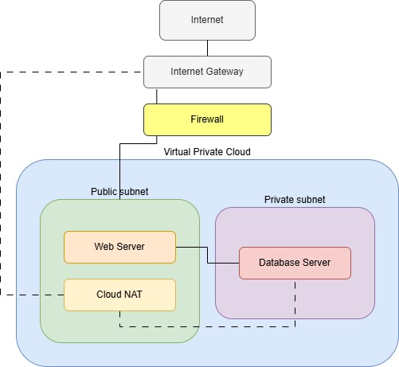
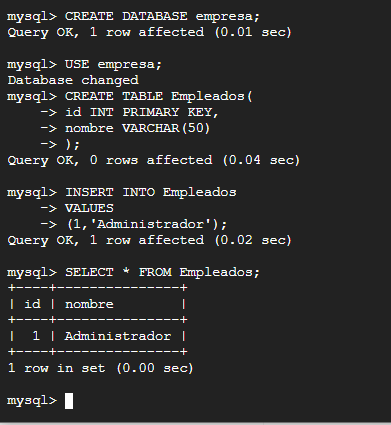
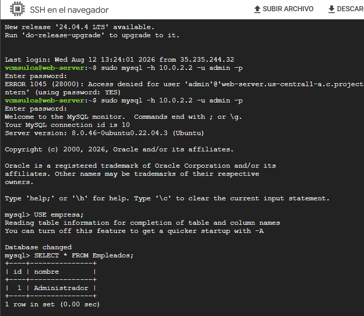

# Cloud-Ready Ops

## Final Integrative Project — Three-Tier Cloud Web Architecture

**Cloud-Ready Ops** is a final integrative project that implements a **three-tier web architecture** deployed in a public cloud environment.

The project simulates a **technical solution delivered to a corporate client**, focusing on network design, compute resources, database infrastructure, security, and connectivity.

The architecture is divided into three main layers:

| Layer        | Component                                               | Purpose                                                   |
| ------------ | ------------------------------------------------------- | --------------------------------------------------------- |
| **Network**  | VPC, Public Subnet, Private Subnet, Firewall, Cloud NAT | Provides network connectivity, segmentation, and security |
| **Application**  | Ubuntu Web Server + Nginx                           | Hosts and serves the web application                      |
| **Database** | Ubuntu Database Server + MySQL                          | Stores and manages application data                       |

---

# Architecture Overview

The infrastructure consists of the following components:

| Component           | Description                                                                                                    |
| ------------------- | -------------------------------------------------------------------------------------------------------------- |
| **Custom VPC**      | Isolated virtual network for all cloud resources                                                               |
| **Public Subnet**   | Hosts the web server and allows controlled Internet access                                                     |
| **Private Subnet**  | Hosts the database server without a public IP address                                                          |
| **Web Server**      | Ubuntu 22.04 running Nginx                                                                                     |
| **Database Server** | Ubuntu 22.04 running MySQL                                                                                     |
| **Firewall**        | Controls inbound and internal network traffic                                                                  |
| **Cloud NAT**       | Allows private resources to access the Internet for outbound connections without requiring public IP addresses |

### Traffic Flow

The architecture follows a controlled traffic flow:



This design improves network segmentation by keeping the database server isolated from direct Internet access.

---

# Network Configuration

The following table summarizes the main network configuration:

| Resource           | Configuration     |
| ------------------ | ----------------- |
| **VPC Name**       | `cloud-ready-vpc` |
| **VPC CIDR**       | `10.0.0.0/16`     |
| **Public Subnet**  | `10.0.1.0/24`     |
| **Private Subnet** | `10.0.2.0/24`     |

### Network Segmentation

| Subnet             | CIDR          | Main Resource   | Internet Exposure                  |
| ------------------ | ------------- | --------------- | ---------------------------------- |
| **Public Subnet**  | `10.0.1.0/24` | Web Server      | Controlled inbound/outbound access |
| **Private Subnet** | `10.0.2.0/24` | Database Server | No public IP                       |

Network segmentation separates the web-facing infrastructure from the database layer, reducing the database's exposure to external traffic.

---

# Firewall Rules

The firewall was configured to allow only the traffic required by the architecture.

| Rule      | Protocol |   Port | Source        | Purpose                                                |
| --------- | -------- | -----: | ------------- | ------------------------------------------------------ |
| **HTTP**  | TCP      |   `80` | `0.0.0.0/0`   | Allows users to access the web server                  |
| **SSH**   | TCP      |   `22` | `0.0.0.0/0`   | Allows remote administration                           |
| **MySQL** | TCP      | `3306` | `10.0.1.0/24` | Allows the web server to communicate with the database |

### Security Considerations

The MySQL port is restricted to the **public subnet CIDR** rather than being exposed to the entire Internet.

The database server does not require a public IP address because it can communicate internally with the web server and use **Cloud NAT** for outbound Internet access.

> **Note:** For a production environment, SSH access should preferably be restricted to trusted administrator IP addresses instead of allowing `0.0.0.0/0`.

---

# Web Server

The web tier was deployed on an Ubuntu virtual machine running Nginx.

| Component            | Configuration |
| -------------------- | ------------- |
| **Operating System** | Ubuntu 22.04  |
| **Web Server**       | Nginx         |
| **Web Content**      | `index.html`  |
| **Network**          | Public Subnet |
| **Protocol**         | HTTP          |
| **Port**             | `80`          |

The Nginx server is responsible for receiving HTTP requests and serving the project's web page to users.

---

# Database Server

The database tier was deployed separately inside the private subnet.

| Component            | Configuration         |
| -------------------- | --------------------- |
| **Operating System** | Ubuntu 22.04          |
| **Database Engine**  | MySQL                 |
| **Network**          | Private Subnet        |
| **Database Table**   | `Employees`           |
| **Database Access**  | Internal network only |



The database server stores application data and is intentionally isolated from direct Internet access.

---

# Cloud NAT

**Cloud NAT** was configured to provide outbound Internet connectivity to resources located in the private subnet.

The database VM can therefore:

* Download software packages and updates.
* Connect to external services when required.
* Access the Internet for outbound connections.
* Operate without a public IP address.

### NAT Traffic Flow

```text
Private Database VM
        │
        ▼
    Cloud NAT
        │
        ▼
    Internet
```

Cloud NAT provides **outbound connectivity** but does not make the private database server directly reachable from the public Internet.

---

# Connectivity and Validation Tests

Several tests were performed to validate the architecture:

| Test                       | Result   | Purpose                                   |
| -------------------------- | -------- | ----------------------------------------- |
| **HTTP Access**            | ✔ Passed | Verified that the web server is reachable |
| **SSH Connectivity**       | ✔ Passed | Verified remote server administration     |
| **VM-to-VM Communication** | ✔ Passed | Verified internal network connectivity    |
| **MySQL Installation**     | ✔ Passed | Verified database server configuration    |
| **Database Creation**      | ✔ Passed | Verified MySQL functionality              |
| **Record Insertion**       | ✔ Passed | Verified data persistence                 |

These tests confirmed the basic functionality and connectivity of the three-tier architecture.



---

# Web Application Content

The `index.html` file served by Nginx displays a personal CV page, used as sample content to demonstrate that the web tier is correctly serving HTTP requests from the public subnet

The page can be accessed directly at:

**http://34.45.121.242/**


---

# Project Summary

The **Cloud-Ready Ops** project demonstrates the implementation of a basic but scalable **three-tier cloud architecture** using network segmentation, virtual machines, Nginx, MySQL, firewall rules, and Cloud NAT.

The architecture follows the principle of separating responsibilities between the **network, web, and database layers**, while reducing unnecessary exposure of internal resources.

### Key Technologies

| Category                  | Technology               |
| ------------------------- | ------------------------ |
| **Cloud Networking**      | VPC                      |
| **Network Segmentation**  | Public & Private Subnets |
| **Security**              | Firewall Rules           |
| **Web Server**            | Nginx                    |
| **Operating System**      | Ubuntu 22.04             |
| **Database**              | MySQL                    |
| **Outbound Connectivity** | Cloud NAT                |
| **Web Protocol**          | HTTP                     |
| **Network Protocol**      | TCP/IP                   |

---

# Author

**Vanina Candelaria Sulca**

**Telecommunications Engineering**

**Cloud-Ready Ops — Final Integrative Project**

